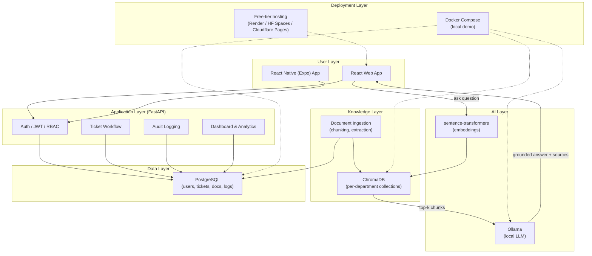
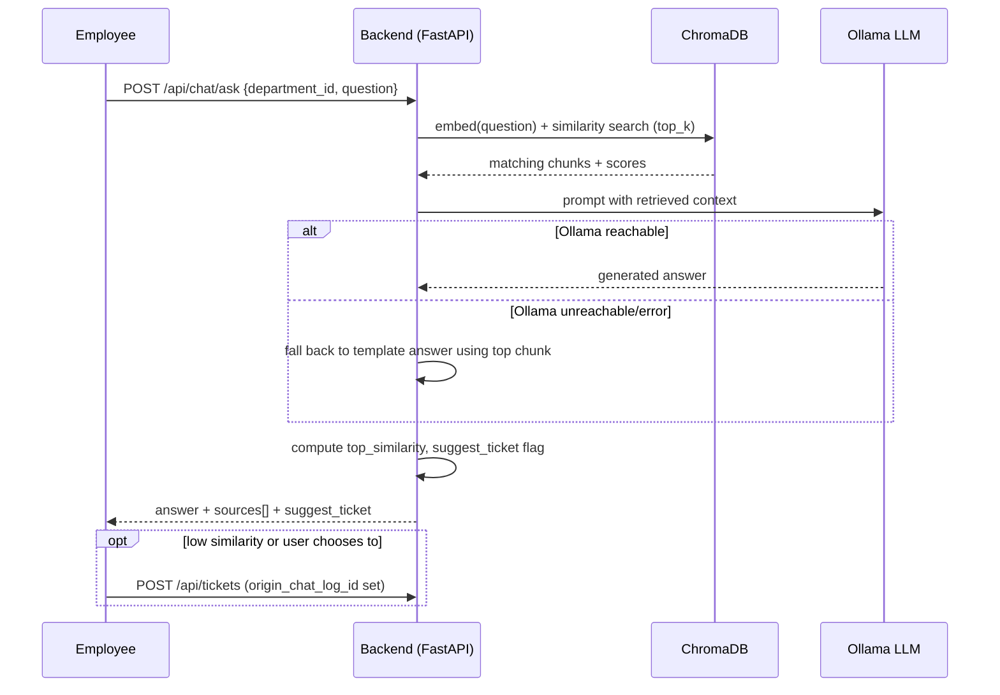

# System Architecture

Matches the 6-layer architecture from the project plan (Section 10).

## Layer overview

| Layer | Components in this build | Purpose |
|---|---|---|
| User | React web app (`/web`), React Native Expo app (`/mobile`) | Employees/officers/admins interact via browser or Android app |
| Application | FastAPI backend (`/backend/app`) — routers, RBAC guards, ticket workflow | Business rules, auth, tickets, dashboard data |
| AI | Ollama (local LLM) + sentence-transformers embeddings | Generates grounded answers from retrieved document text |
| Knowledge | ChromaDB (persistent, one collection per department) + chunking/extraction in `rag_service.py` | Stores document vectors, finds relevant chunks |
| Data | PostgreSQL (Docker) / SQLite (local dev fallback) | Users, departments, tickets, chat logs, documents, audit logs |
| Deployment | `docker-compose.yml` (local demo) + notes for free-tier hosting | Offline demo primary; optional public showcase |

## Diagram

## RAG request flow (detail)

## Key design decisions / assumptions

- **SQLite fallback**: local dev without Docker defaults to SQLite (explicitly allowed by the project plan); `docker-compose.yml` uses Postgres by default, per spec.
- **Embedding fallback**: if `sentence-transformers` can't download model weights (no internet), the system falls back to a lightweight hashing-based embedder rather than crashing. This is a deliberate robustness choice beyond the spec's explicit Ollama-only fallback requirement, since embedding-model download failures are just as likely to break a fresh-clone demo as an LLM outage.
- **One Chroma collection per department**: keeps documents/embeddings isolated per department without extra infrastructure, matching the "documents separated by department" security requirement.
- **Similarity → confidence score**: `score = 1 - (distance / 2)`, clamped to `[0, 1]`. This is an implementation choice (not specified in the plan) for turning Chroma's raw distance into an intuitive 0–1 number used for the ticket-suggestion threshold.
