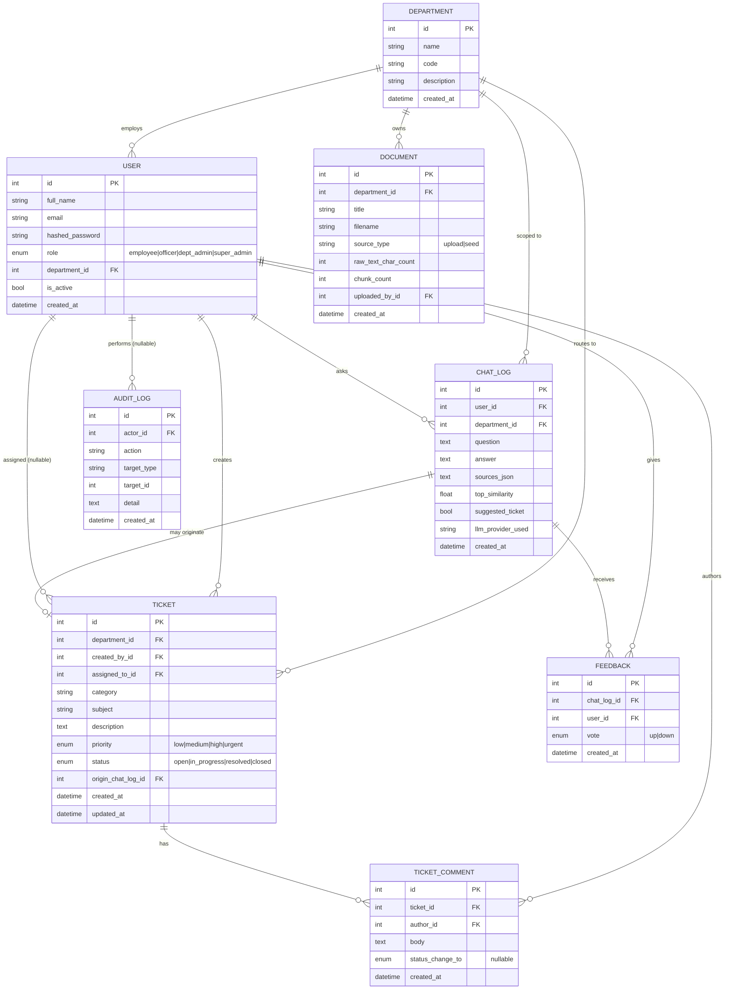

# Database ER Diagram

Note: document *content* (chunked text + embeddings) lives in ChromaDB, not
Postgres/SQLite — the `DOCUMENT` table above only stores metadata
(title, filename, chunk count). This keeps the relational schema clean and
matches the plan's "Knowledge layer" being a separate store from the
"Data layer" (Section 10).
